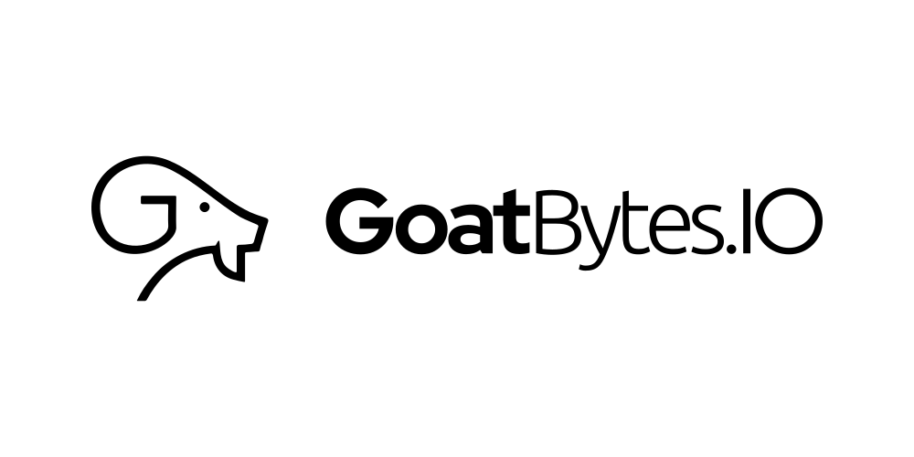

<p align="center">
  <a href="https://styles.goatbytes.io/lang/kotlin" rel="nofollow"></a>
<a href="https://central.sonatype.com/artifact/io.goatbytes/kflect">
-%230037FF?style=flat-square&logo=gradle" alt="Gradle Dependency" />

</a>
  
</p>

## Getting Started

### Gradle

Add the following to your `build.gradle.kts` in your project:

```kotlin
dependencies {
  implementation("io.goatbytes:kflect:0.1.0-beta")
}
```

## Contributing

Contributions are welcome! Please read our [contributing guide](CONTRIBUTING.md) and submit pull
requests to our repository.

## License

This project is licensed under the Apache 2.0 License — see the [LICENSE](LICENSE) file for details.

## ℹ️ About GoatBytes.IO <a name="about"></a>



<p align="center">
<a href="https://github.com/goatbytes" target="_blank">
    
</a>
<a href="https://twitter.com/goatbytes" target="_blank">
    
</a>
<a href="https://www.linkedin.com/company/goatbytes" target="_blank">
    
</a>
<a href="https://www.instagram.com/goatbytes.io/" target="_blank">
    
</a>
</p>

At **GoatBytes.IO**, our mission is to develop secure software solutions that empower businesses to
transform the world. With a focus on innovation and excellence, we strive to deliver cutting-edge
products that meet the evolving needs of businesses across various industries.

[eskotlin]: https://github.com/mbuhot/eskotlin
